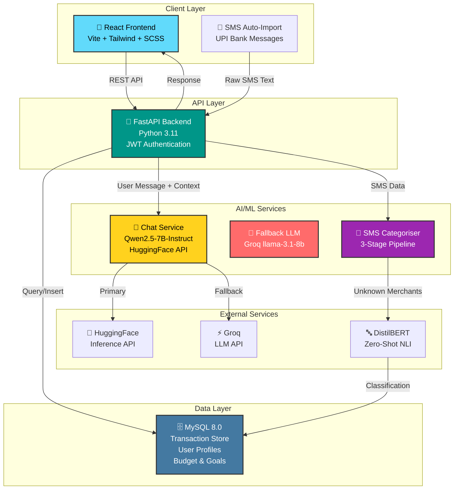
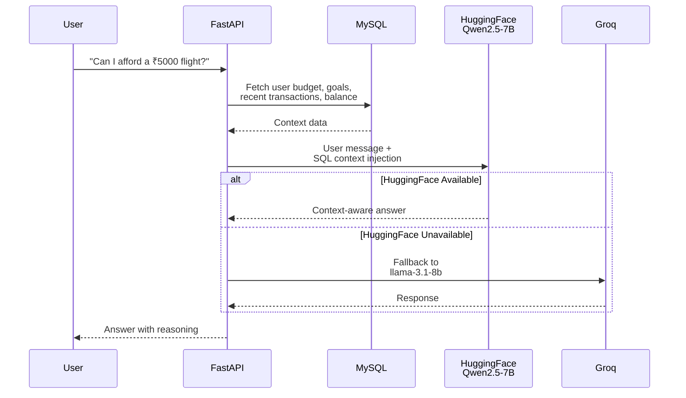
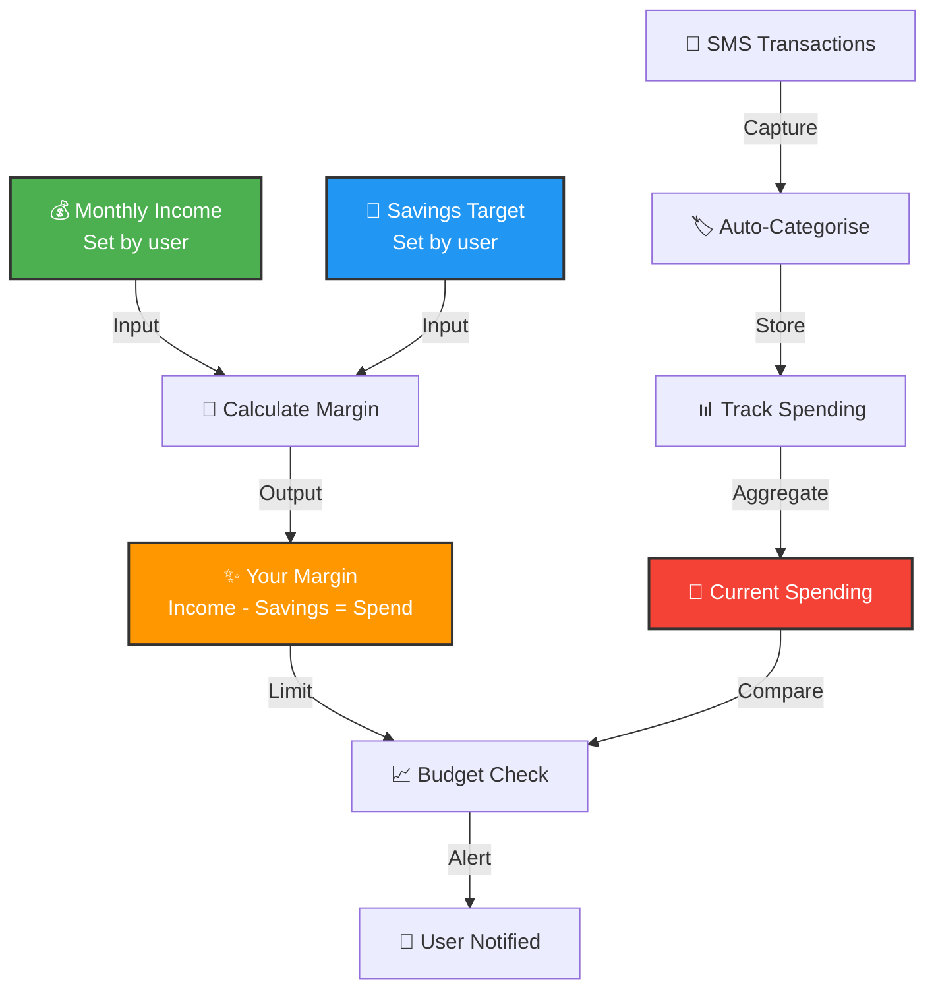
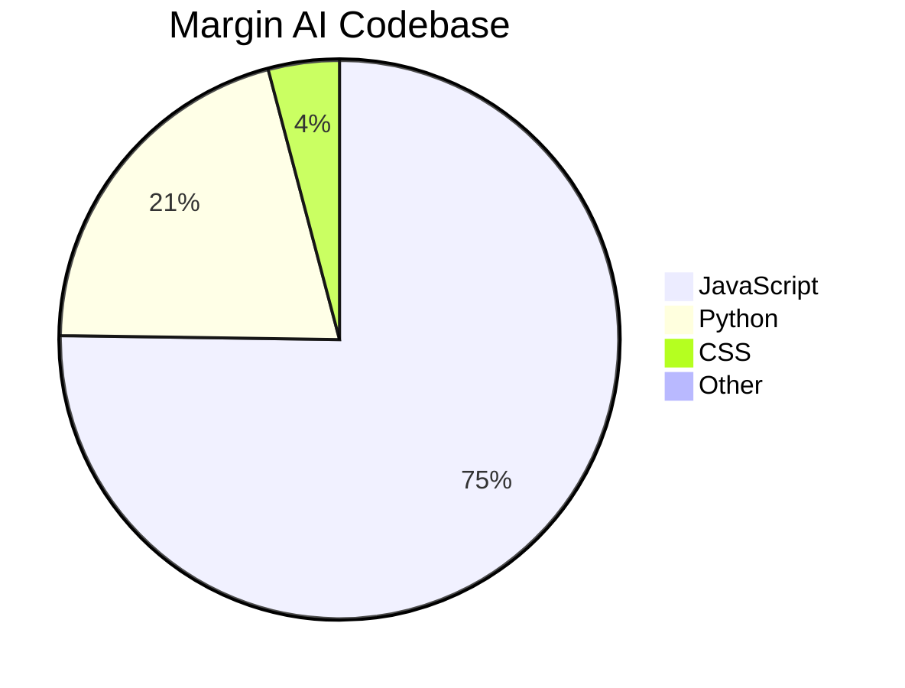

# Margin AI - Architecture Overview

## System Architecture

## Component Breakdown

### Frontend (75% JavaScript)
- **Framework**: React 18 with Vite
- **Styling**: Tailwind CSS + SCSS
- **Features**:
  - Live dashboard with spending analytics
  - Chat interface for financial queries
  - Income & savings setup page
  - User profile with avatar upload
  - Transaction history view

### Backend (20% Python)
- **Framework**: FastAPI (Python 3.11)
- **Authentication**: JWT tokens
- **API Endpoints**:
  - User management & auth
  - Transaction CRUD
  - Budget & goals management
  - Chat endpoint (with context injection)
  - SMS processing & categorization

### Database Layer (MySQL 8.0)
- User profiles & authentication
- Transaction history
- Budget & savings goals
- Chat message history
- Cached categorization results

## AI/ML Pipeline

### SMS Categorisation - 3-Stage NLP Pipeline

```mermaid
graph LR
    SMS["Raw Bank SMS<br/>e.g., 'Swiggy debit ₹450'"]
    
    Stage1["📌 Stage 1: Regex<br/>Amount + Merchant<br/>Transaction Type"]
    
    Stage2["🗺️ Stage 2: Keyword Map<br/>50+ Merchants<br/>Instant Match"]
    
    Stage3["🤖 Stage 3: DistilBERT NLI<br/>typeform/distilbert<br/>7-Category Zero-Shot"]
    
    Categories["🏷️ Categories<br/>Food · Transport<br/>Shopping · Entertainment<br/>Health · Utilities · Misc"]
    
    DB["💾 Store in MySQL"]
    
    SMS -->|Extract| Stage1
    Stage1 -->|Match Known?| Stage2
    Stage2 -->|Unknown?| Stage3
    Stage3 -->|Classify| Categories
    Categories -->|Persist| DB

    style SMS fill:#FFE082,stroke:#333,stroke-width:2px
    style Stage1 fill:#81C784,stroke:#333,stroke-width:2px,color:#fff
    style Stage2 fill:#64B5F6,stroke:#333,stroke-width:2px,color:#fff
    style Stage3 fill:#9C27B0,stroke:#333,stroke-width:2px,color:#fff
    style Categories fill:#FF7043,stroke:#333,stroke-width:2px,color:#fff
    style DB fill:#4479A1,stroke:#333,stroke-width:2px,color:#fff
```

**Efficiency**: Regex + keyword map handle ~90% of cases. DistilBERT only fires for unknown merchants—keeping it fast and free.

### Chat with Context - Qwen2.5-7B-Instruct

## Data Flow - Income to Margin

## Technology Stack Summary

| Layer | Technology | Purpose |
|-------|-----------|---------|
| **Frontend** | React 18, Vite, Tailwind, SCSS | UI/UX for spending dashboard & chat |
| **Backend** | FastAPI, Python 3.11, JWT | REST API, business logic, auth |
| **Database** | MySQL 8.0 | Persistent storage |
| **Chat AI** | Qwen2.5-7B (HuggingFace) | Natural language financial answers |
| **Fallback** | Groq llama-3.1-8b | Backup LLM if HF unavailable |
| **NLP** | DistilBERT (zero-shot) | Transaction categorization |
| **SMS** | Custom regex + keyword map | Parse bank messages |

## Deployment Status

| Component | Status |
|-----------|--------|
| Backend API | ✅ Complete |
| Database Schema | ✅ Complete |
| Frontend UI | ✅ Complete |
| AI Chat (Qwen + Fallback) | ✅ Complete |
| SMS NLP Pipeline | ✅ Complete |
| Income Page | ✅ Complete |
| Production Deployment | 🔜 Coming soon |
| Android SMS Bridge | 🔜 Coming soon |

## Language Composition

---

**Built by**: Shriya Shetty · Finance Student  
**Repository**: [shetty30/margin_ai](https://github.com/shetty30/margin_ai)
